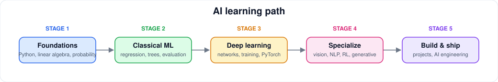

# AI Learning Path

[← Guides](README.md)

A staged path. Move on when you can *build* something at the current stage, not when you have watched enough videos.

1. **Foundations.** [Python](../resources/programming/python.md), [linear algebra](../resources/math/linear-algebra.md), [probability & statistics](../resources/math/probability-statistics.md).
2. **Classical ML.** [Machine learning](../resources/ai/machine-learning.md): a full project with a baseline, honest evaluation and error analysis.
3. **Deep learning.** [Deep learning](../resources/ai/deep-learning.md): train a network from scratch, then with a framework.
4. **Specialize.** [Computer vision](../resources/ai/computer-vision.md), [NLP](../resources/ai/nlp.md), [LLMs](../resources/ai/llms.md), [reinforcement learning](../resources/ai/reinforcement-learning.md) or [generative AI](../resources/ai/generative-ai.md).
5. **Build & ship.** [AI engineering](../resources/ai/ai-engineering.md), plus [research skills](../resources/ai/ai-research.md) if you want depth.
