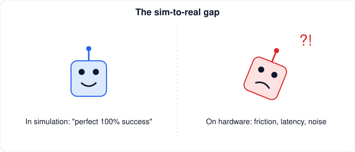

# AI → Robotics Transition

[← Guides](README.md)

If you know ML, the gaps are usually:

1. **Geometry and frames.** [Transformations](../resources/math/geometry-transformations.md).
2. **Control and dynamics.** [Control](../resources/robotics/control.md), [kinematics & dynamics](../resources/robotics/kinematics-dynamics.md).
3. **State estimation.** [Sensor fusion](../resources/robotics/sensors-sensor-fusion.md), [SLAM](../resources/robotics/localization-mapping-slam.md).
4. **Real-time systems.** [ROS 2](../resources/robotics/ros-2.md), [C++](../resources/programming/cpp.md).
5. **Then combine.** [Robot learning](../resources/robotics/robot-learning.md) and [embodied AI](../resources/robotics/embodied-ai.md) in [simulation](../resources/simulation/README.md).

Robots break ML assumptions: data is sequential, actions change the data, and failure has physical cost.

