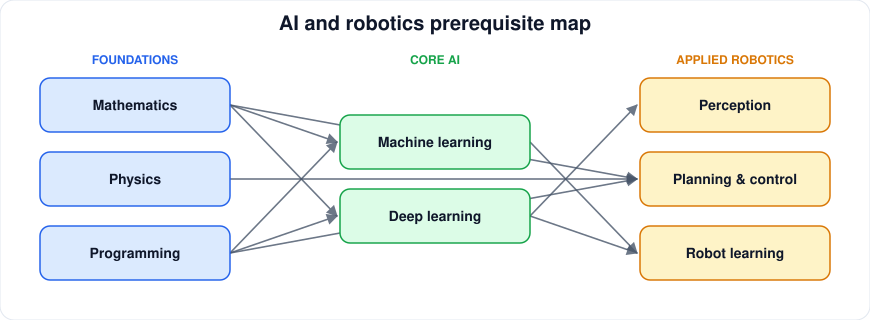

# Mathematics Prerequisites

[← Guides](README.md)

| You want to learn | You need first |
|---|---|
| Machine learning | [Linear algebra](../resources/math/linear-algebra.md), [probability](../resources/math/probability-statistics.md), basic [calculus](../resources/math/calculus.md) |
| Deep learning | Above, plus multivariable calculus and [optimization](../resources/math/optimization.md) |
| Robot kinematics | [Geometry & transformations](../resources/math/geometry-transformations.md), linear algebra |
| State estimation / SLAM | Probability, linear algebra, optimization |
| Control | Calculus, differential equations, linear algebra |

Learn math just in time: start a project, hit a gap, fill it.
