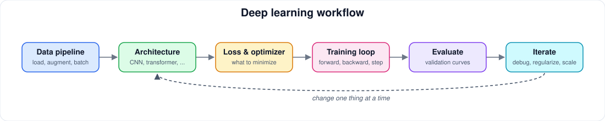

# Deep Learning

[← Artificial Intelligence](README.md) · [Home](../../README.md)

> Neural networks, backpropagation, CNNs, transformers, training practice.

**Status:** structure ready, curation pending. Only verified, legitimately free resources are listed; none are added until checked.

## 📚 Books

- [Deep Learning](https://www.deeplearningbook.org/)
- [Dive into Deep Learning](https://d2l.ai/)
- [Neural Networks and Deep Learning](http://neuralnetworksanddeeplearning.com/)

## 🎓 University Courses

- [MIT 6.S191 Introduction to Deep Learning](https://ocw.mit.edu/courses/6-s191-introduction-to-deep-learning-january-iap-2020/)
- [Stanford CS231n](https://cs231n.stanford.edu/)
- [Stanford CS224n](https://web.stanford.edu/class/cs224n/)

## 🎓 Online Courses

- [fast.ai Practical Deep Learning](https://course.fast.ai/)
- [Hugging Face Course](https://huggingface.co/learn/nlp-course/)
- [DeepLearning.AI free resources](https://www.deeplearning.ai/resources/)

## ▶️ YouTube & Lecture Series

- [MIT 6.S191](https://www.youtube.com/@MITOpenCourseWare)
- [Stanford CS231n](https://www.youtube.com/@stanfordonline)
- [Andrej Karpathy Neural Networks: Zero to Hero](https://www.youtube.com/@AndrejKarpathy)

## 🌐 Websites & Tutorials

- [Dive into Deep Learning](https://d2l.ai/)
- [PyTorch tutorials](https://docs.pytorch.org/tutorials/)
- [TensorFlow tutorials](https://www.tensorflow.org/tutorials)

## 📝 Lecture Notes

- [Stanford CS231n notes](https://cs231n.github.io/)
- [Stanford CS224n notes](https://web.stanford.edu/class/cs224n/)
- [MIT 6.S191 materials](https://ocw.mit.edu/courses/6-s191-introduction-to-deep-learning-january-iap-2020/)

## 📄 Research Papers

- [ResNet](https://arxiv.org/abs/1512.03385)
- [Attention Is All You Need](https://arxiv.org/abs/1706.03762)
- [Generative Adversarial Nets](https://arxiv.org/abs/1406.2661)

## 💻 Projects

- [PyTorch tutorials](https://docs.pytorch.org/tutorials/)
- [fast.ai notebooks](https://github.com/fastai/course22)
- [Hugging Face notebooks](https://github.com/huggingface/notebooks)

## 🧪 Interactive Resources

- [TensorFlow Playground](https://playground.tensorflow.org/)
- [Distill visual essays](https://distill.pub/)
- [CNN Explainer](https://poloclub.github.io/cnn-explainer/)

## 🛠️ Official Documentation

- [PyTorch](https://docs.pytorch.org/)
- [TensorFlow](https://www.tensorflow.org/guide)
- [Keras](https://keras.io/guides/)
