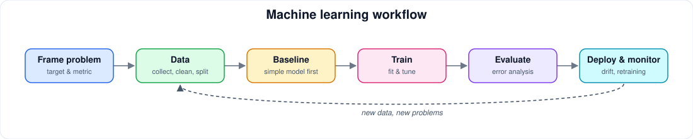

# Machine Learning

[← Artificial Intelligence](README.md) · [Home](../../README.md)

> Classical ML: regression, classification, trees, evaluation, and the practical workflow.

**Status:** structure ready, curation pending. Only verified, legitimately free resources are listed; none are added until checked.

## 📚 Books

- [Dive into Deep Learning](https://d2l.ai/)
- [An Introduction to Statistical Learning](https://www.statlearning.com/)
- [Understanding Machine Learning](https://www.cs.huji.ac.il/~shais/UnderstandingMachineLearning/)

## 🎓 University Courses

- [MIT 6.036 Introduction to Machine Learning](https://ocw.mit.edu/courses/6-036-introduction-to-machine-learning-fall-2020/)
- [Stanford CS229](https://cs229.stanford.edu/)
- [CMU 10-301 Machine Learning](https://www.cs.cmu.edu/~mgormley/courses/10601/about.html)

## 🎓 Online Courses

- [Google Machine Learning Crash Course](https://developers.google.com/machine-learning/crash-course)
- [fast.ai Practical Deep Learning](https://course.fast.ai/)
- [Kaggle Learn](https://www.kaggle.com/learn)

## ▶️ YouTube & Lecture Series

- [Stanford CS229](https://www.youtube.com/@stanfordonline)
- [MIT OpenCourseWare machine learning](https://www.youtube.com/@mitocw)
- [StatQuest](https://www.youtube.com/@statquest)

## 🌐 Websites & Tutorials

- [scikit-learn User Guide](https://scikit-learn.org/stable/user_guide.html)
- [Google ML Crash Course](https://developers.google.com/machine-learning/crash-course)
- [Machine Learning Yearning](https://www.deeplearning.ai/resources/machine-learning-yearning/)

## 📝 Lecture Notes

- [Stanford CS229 notes](https://cs229.stanford.edu/main_notes.html)
- [MIT 6.036 materials](https://ocw.mit.edu/courses/6-036-introduction-to-machine-learning-fall-2020/)
- [CMU 10-301](https://www.cs.cmu.edu/~mgormley/courses/10601/about.html)

## 💻 Projects

- [scikit-learn examples](https://scikit-learn.org/stable/auto_examples/index.html)
- [Kaggle Learn](https://www.kaggle.com/learn)
- [MLflow examples](https://github.com/mlflow/mlflow/tree/master/examples)

## 🧪 Interactive Resources

- [TensorFlow Playground](https://playground.tensorflow.org/)
- [Google ML Crash Course exercises](https://developers.google.com/machine-learning/crash-course)
- [Kaggle Learn](https://www.kaggle.com/learn)

## 🛠️ Official Documentation

- [scikit-learn](https://scikit-learn.org/stable/)
- [PyTorch](https://docs.pytorch.org/)
- [TensorFlow](https://www.tensorflow.org/guide)
