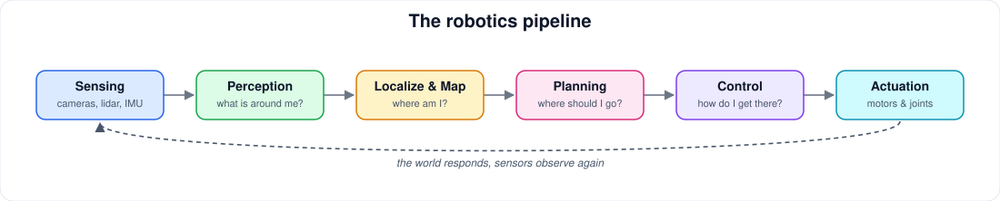

# Robotics

[← Home](../../README.md)

The full robotics stack: modeling, control, perception, SLAM, planning, manipulation, ROS 2, and robot learning.

## Subjects

- [Robotics Fundamentals](robotics-fundamentals.md): Overview of robot systems, components and the sense-plan-act loop.
- [Kinematics & Dynamics](kinematics-dynamics.md): Forward/inverse kinematics, Jacobians, rigid-body dynamics.
- [Control](control.md): Feedback control, PID, state space, optimal and model-predictive control.
- [Perception](perception.md): Robot vision, depth, point clouds, object detection for robots.
- [Sensors & Sensor Fusion](sensors-sensor-fusion.md): Cameras, lidar, IMUs, encoders; Kalman filters and fusion.
- [Localization, Mapping & SLAM](localization-mapping-slam.md): State estimation, probabilistic robotics, SLAM.
- [Planning & Navigation](planning-navigation.md): Path and motion planning, navigation stacks.
- [Manipulation](manipulation.md): Arms, grasping, whole-task manipulation.
- [ROS 2](ros-2.md): The Robot Operating System 2: nodes, topics, tooling, Nav2, MoveIt.
- [Autonomous Systems](autonomous-systems.md): Drones and autonomous vehicles.
- [Robot Learning](robot-learning.md): RL and imitation learning for robots, sim-to-real.
- [Embodied AI & VLA Models](embodied-ai.md): Vision-language-action models and foundation models for robots.
- [Humanoid & Legged Robotics](humanoid-legged.md): Legged locomotion and humanoid platforms.
