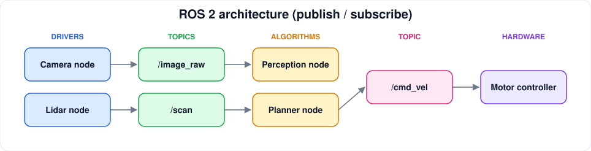

# ROS 2

[← Robotics](README.md) · [Home](../../README.md)

> The Robot Operating System 2: nodes, topics, tooling, Nav2, MoveIt.

**Status:** structure ready, curation pending. Only verified, legitimately free resources are listed; none are added until checked.

## 🎓 Online Courses

_No verified entries yet. Add 3–5 of the best, following the [entry template](../../CONTRIBUTING.md#entry-template)._

## ▶️ YouTube & Lecture Series

_No verified entries yet. Add 3–5 of the best, following the [entry template](../../CONTRIBUTING.md#entry-template)._

## 🌐 Websites & Tutorials

_No verified entries yet. Add 3–5 of the best, following the [entry template](../../CONTRIBUTING.md#entry-template)._

## 🛠️ Official Documentation

_No verified entries yet. Add 3–5 of the best, following the [entry template](../../CONTRIBUTING.md#entry-template)._

## 🧑‍💻 Hands-on Labs

_No verified entries yet. Add 3–5 of the best, following the [entry template](../../CONTRIBUTING.md#entry-template)._

## 💻 Projects

_No verified entries yet. Add 3–5 of the best, following the [entry template](../../CONTRIBUTING.md#entry-template)._
